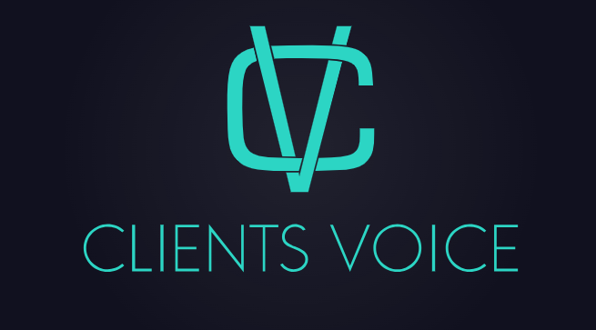
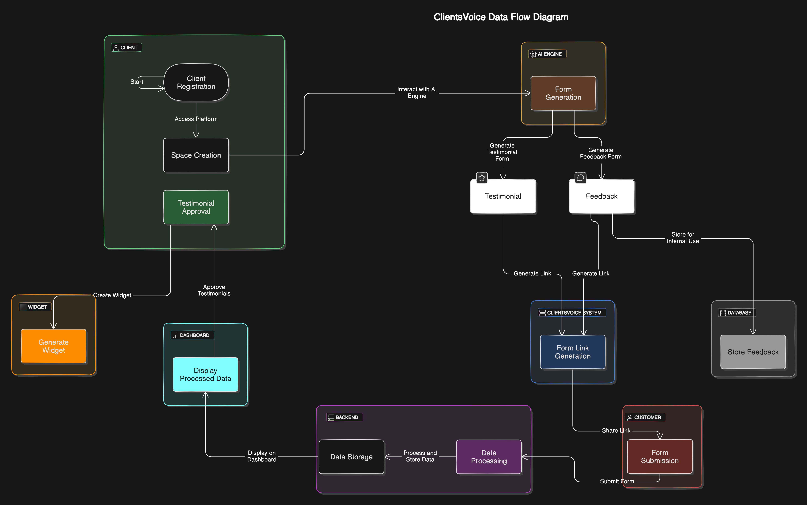

# 🌟 ClientsVoice

**ClientsVoice** is a project designed to help businesses streamline the collection and display of customer feedback and testimonials. By leveraging AI for form generation, ClientsVoice simplifies the process of gathering valuable insights while showcasing positive customer experiences.

---

## 🚀 Project Overview
 

- **Purpose**: 
  ClientsVoice allows businesses to collect both feedback (for internal improvement) and testimonials (for public display). This project aims to build credibility and enhance customer trust through authentic testimonials.

- **Key Features**:
  - **🤖 AI-Driven Form Generation**: Automatically creates customized feedback forms based on business needs using the OpenAI API, making it adaptable to various industries.
  - **📊 Unified Feedback Collection**: Collects both feedback and testimonials in a single submission process, streamlining user interaction.
  - **💬 Testimonial Display**: Easily embed testimonials on websites using an iframe. Users can customize the styling to match their brand identity.
  - **🔒 Secure Data Storage**: Feedback and testimonials are securely stored in a MongoDB database with encryption for data privacy.
  - **📈 Analytics and Insights**: Provides actionable insights through data visualization tools, allowing businesses to track trends and improve customer satisfaction.
  - **💻 Easy Integration**: Reduce coding efforts by simply embedding our widget code. Once embedded, your testimonials will appear wherever you want on your website with minimal setup.

---

## 🛠️ Tech Stack

- **Frontend**: 
  - **React**: For building user interfaces with a component-based architecture.
  - **Tailwind CSS**: For utility-first CSS styling, allowing for rapid design without leaving the HTML.

- **Backend**: 
  - **Node.js**: JavaScript runtime for building the server-side application.
  - **Express**: Web framework for Node.js, facilitating API development and middleware integration.
  - **JWT Authentication**: Provides secure login and authorization mechanisms for businesses.

- **Database**: 
  - **MongoDB**: NoSQL database for flexible schema design and easy scalability. Stores user data, feedback, and testimonials.

- **AI Integration**: 
  - **Gemini API**: Utilized for AI-driven form generation, enabling dynamic question creation based on user input and context.

---

## 📋 Project Flow

1. **Form Creation**: 
   - Businesses specify their needs through an intuitive UI. The backend generates a custom feedback form dynamically.

2. **Feedback Collection**: 
   - Customers access the generated form via a link. The form submission triggers GraphQL mutations.

3. **Testimonial Display**: 
   - Businesses can embed testimonials on their website through an iframe.

4. **Analytics and Insights**: 
   - The collected data is processed to generate visual reports.

---

## 📊 Data Flow Diagram

**Description**:  
The Data Flow Diagram illustrates how data moves through the ClientsVoice system. It shows the relationships between different entities (like users, the AI model, and the database) and how they interact with one another during the process of feedback collection and testimonial display.

---

## 🎉 Benefits

- **✅ Easy and Efficient**: AI automates form creation, reducing manual effort and enhancing user experience.
- **📥 Unified Collection**: Gather both feedback and testimonials in a single, streamlined process.
- **🌟 Builds Credibility**: Displaying authentic testimonials enhances trust with potential customers.
- **📊 Actionable Insights**: Feedback is transformed into visual insights, allowing for informed business decisions.
- **🔒 Data Security**: User data is encrypted and securely stored, ensuring compliance with data protection regulations.
- **💻 Write Less Code**: Integrate seamlessly by embedding our widget code, allowing you to display testimonials anywhere on your website with minimal coding effort.
---

## 📌 Conclusion

ClientsVoice simplifies the process of collecting and utilizing customer feedback. By automating form generation and making it easy to display testimonials, businesses can improve their operations and attract more customers. This project aims to enhance user experience while providing valuable insights through advanced technology.

---
